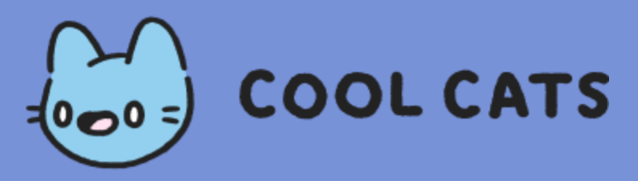

## Description

NestJS REST server providing endpoints for the Cool Cats NFT project

## Installation

```bash
$ npm install
```

## Running the app

```bash
# development
$ npm run start

# watch mode
$ npm run start:dev

# production mode
$ npm run start:prod
```

## Test

```bash
# unit tests
$ npm run test

# e2e tests
$ npm run test:e2e

# test coverage
$ npm run test:cov
```

# REST Endpoints

## Authenticated Endpoints
Authenticated endpoints require thatthe proper authentication header be sent along with the request.

##Marketplace
### /chain/list-item

### /cat/:id
Retrieves the full description of a cat specified by its token ID.

```

```

## License

Nest is [MIT licensed](LICENSE). However, the code in this repository is (C) 2021 Cool Cats Group LLC  - ALL RIGHTS RESERVED
